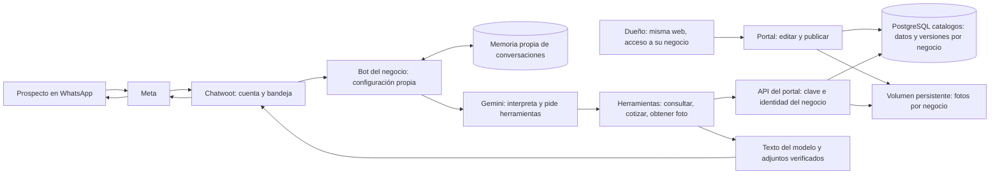

# Conexión del catálogo con Smarth House: revisión y continuidad

> **Revisión histórica, anterior al despliegue.** El usuario autorizó después
> la migración y ya se ejecutó. Para continuar, leer primero
> [despliegue-smarth-portal.md](../despliegue-smarth-portal.md): Smarth House
> consulta el portal y envía fotos, con respuestas breves. No volver a pedir
> la autorización pendiente descrita aquí ni repetir las altas o los envíos.
> Los estados, ramas y pendientes de las secciones siguientes corresponden
> al momento de esta revisión, salvo las correcciones expresas.

Revisión del **14/09/2026**, trabajada en la rama **portal**, desde
`4353f20`. Este documento describe el resultado de la revisión, lo que se
probó y lo que falta. Leerlo junto con [operación](../operacion.md) y
[metodología](../metodologia-clientes.md) antes de continuar.

## Estado real: qué se cambió y qué sigue igual

**La integración ampliada está preparada y probada; el WhatsApp de la campaña
todavía no la ejecuta.** No se hizo push, merge a main ni despliegue durante
esta revisión. Los cambios de código y documentación quedan en un commit
local de portal; consultar `git log -1` para su identificador.

| Aplicación | Rama observada | Despliegue automático observado | Estado |
|---|---|---|---|
| agente-ia | main, `44bc631` | Activado | Salud OK; sigue con sistema.md |
| bot-demo | piloto-demo, `e36ac73` | Desactivado | Salud OK; sigue con uniformes |
| portal-catalogos | portal, base `4353f20` | Desactivado | Salud OK; catálogo publicado |

Los indicadores de despliegue automático se consultaron en Coolify; volver a
comprobarlos antes de un push. Las referencias main y piloto-demo no se
movieron. `prompts/sistema.md` y `prompts/demo_uniformes.md` no se editaron.
No se tocaron variables de los bots, webhooks, automatizaciones ni memorias.

Sí hubo estas operaciones autorizadas fuera de Git:

- Publicar correcciones de PLAN-1, confirmadas por el usuario (detalle abajo).
- Crear una clave de lectura del portal, limitada al negocio smarth-house.
- Crear una conversación sintética en la bandeja API de pruebas y enviarle
  el texto y la foto para comprobar Chatwoot. No se contactó ningún WhatsApp.
- Ejecutar las pruebas de contrato contra catalogos_pruebas; crean y limpian
  sus propios registros ficticios.

## Oferta publicada y decisiones confirmadas

La publicación actual de Smarth House quedó en **versión 4**:

| Campo de PLAN-1 | Valor |
|---|---|
| Tipo | Promoción |
| Precio y moneda | US$45 |
| Unidad | al mes por número de WhatsApp |
| Inicio / fin | 07/09/2026 / 11/10/2026, inclusive |
| Cotización automática | Desactivada; no se cambió este permiso |
| Plan regular posterior | No publicado; lo confirma el equipo |

Descripción aprobada y publicada:

> Hasta 1.000 conversaciones mensuales. Incluye panel CRM, app móvil, soporte
> y capacitación. Quienes contraten dentro de la vigencia conservan esta
> tarifa en el plan de hasta 1.000 conversaciones mensuales

La versión 3 corrigió tipo y unidad; la 4 añadió esa descripción. Se comprobó
que no hubiera otro borrador pendiente antes de publicar. No se inventó un
plan regular ni un precio de instalación. Mi negocio ya estaba publicado.

PLAN-1 tiene dos registros de fotografía con el mismo contenido. No se
borraron; el consumidor usa la primera foto de cada ítem, así que envía una
sola para esa promoción. La imagen se descargó, se inspeccionó y coincide con
los beneficios y la tarifa. Su SHA-256 es
`5eaabf3d9eccf50aea57b504d463b21de075a2056de74288ddd9da47d1d71364`.

La descripción escrita sigue siendo necesaria: **el bot no analiza la imagen
del catálogo para extraer precios o beneficios**. El administrador debe
mantener texto y fotografía coherentes.

## Cómo funciona y cómo se incorpora otro negocio



Todos los clientes pueden usar `https://catalogos.automaticnic.online`.
El usuario autenticado y sus accesos determinan qué negocio puede ver o editar.
Una persona puede tener acceso explícito a varios negocios; no obtiene acceso
al resto por usar la misma URL.

Cada nuevo negocio necesita alta, usuario administrador, clave de lectura del
bot, publicación, aplicación del bot, cuenta/bandejas de Chatwoot y memoria
con permisos propios. Se reutiliza código; **una rama no es la separación de
datos entre clientes**. El alta todavía se administra con
`scripts/portal_admin.py`; no hay un alta comercial automática completa.

Dos números del mismo negocio pueden compartir catálogo y filtrar por
`PORTAL_LINEA`. El consumidor ya filtra ítems y dirección/horarios por línea.
El webhook actual configura una bandeja por aplicación: para dos líneas
diferentes se pueden preparar dos aplicaciones, cada una con su bandeja,
línea y memoria. Un único proceso que enrute dinámicamente varias bandejas
queda pendiente. No se conectaron los números del prospecto de uniformes.

**Corrección posterior:** la afirmación original de que existía el volumen
`portal_datos` era incorrecta; el contenedor no tenía montajes. Se respaldaron
las fotos y se configuró un bind mount persistente en `/app/datos/portal`,
verificado tras el despliegue (rutas en el nuevo registro).
`Almacen` separa los archivos por negocio. PostgreSQL
guarda la relación negocio → SKU → foto, su identificador, tipo, tamaño y
huella. El bot no inventa URLs: descarga el identificador autorizado,
comprueba los bytes y adjunta el archivo a Chatwoot.

Gemini recibe datos de los ítems encontrados, no los bytes de las fotos
salientes ni todo el catálogo en cada pregunta. El envío de esa imagen no
requiere que Gemini la interprete. Las llamadas a herramientas sí añaden
texto y pueden implicar otra llamada al modelo; no equivale a costo cero.

## Correcciones incluidas en el código local

- `fuente_portal.py` exige HTTPS, evita reenviar la clave por redirecciones y
  valida identidad, formato y huella de la publicación.
- La caché queda separada por origen, clave y negocio esperado. Una caída
  transitoria permite consultar una copia de hasta cinco minutos, indicando
  que requiere confirmación. Un rechazo de credenciales invalida la copia.
  No se cotiza usando el respaldo.
- Cada foto se valida por tipo, tamaño y SHA-256. Escrituras atómicas con
  temporales únicos evitan archivos parciales y colisiones entre turnos.
- `portal.py` incorpora `ver_catalogo`, `datos_del_negocio`,
  `mostrar_fotos` y `cotizar_pedido`, además de promociones. Sin promoción,
  devuelve servicios regulares publicados; si faltan, deriva al equipo.
- Se exige configurar URL, clave e identidad juntas. No se permite mezclar
  portal con los archivos de catálogo/promociones de la demo.
- Cotizaciones con Decimal: cantidad, descuentos publicados sobre el precio
  base, recargos y extras por unidad. Precios “desde”, trabajos a medida,
  agotados, opciones desconocidas o cantidades fuera del límite se derivan.
- El cálculo guarda versión, huella e importes en el resultado de herramienta
  de la conversación. **No es un módulo independiente de pedidos, facturas o
  presupuestos PDF.** Calcula un ítem y combinación por llamada; no un carrito
  con descuentos entre productos o monedas.
- Los endpoints de fotos de empleados y bots comprueban que la foto forme
  parte de la publicación. Los administradores pueden revisar borradores.
  **Esta corrección del servidor portal necesita su propio despliegue**:
  todavía no está activa en el portal publicado.
- Se excluyen credenciales, copias privadas y temporales de Git/Docker.
- `portal_admin.py --archivo-env` permite elegir expresamente el archivo del
  destino. Las variables del proceso conservan prioridad: revisar el destino,
  no copiar un comando de alta de pruebas sobre producción.
- `/salud` identifica si se configuró el portal y publica la huella de sus
  reglas, sin exponer credenciales. Esto no comprueba la conectividad de la API.
- `scripts/desplegar.py --prompt` permite comprobar el prompt alternativo del
  commit desplegado; por defecto sigue comprobando `prompts/sistema.md`.

## Memoria y catálogo: alcance comprobado

El portal usa la base `catalogos` y su propio rol `portal_catalogos`.
No escribe en los checkpointers. El bot conserva su conversación y consulta
las condiciones comerciales mediante herramientas. Se conserva el
`thread_id` actual para no perder los chats de la campaña.

Se probó una conversación que consultó 45, recibió una nueva publicación a
55 y volvió a consultar: mantuvo el historial, recibió el precio nuevo y no
reenvió adjuntos antiguos en el turno “gracias”. Las cotizaciones anteriores
conservan el cálculo que se hizo en su momento.

**Límite que hay que vigilar:** la decisión de llamar herramientas sigue
siendo del modelo. El prompt exige consultar en el turno actual y priorizar
el portal, pero eso no es una garantía matemática sobre toda respuesta.
En la prueba real Gemini respondió una repregunta sobre beneficios usando el
resultado previo. Era correcto, pero no hizo otra consulta en ese turno.
La aceptación en vivo debe incluir un chat con historial anterior y una
consulta nueva de precio. No resolver posibles respuestas viejas borrando
todas las memorias.

**Hallazgo de permisos heredados:** agente-ia conecta a la base `postgres`
como rol `postgres`, que es superusuario. No se puede afirmar que hoy todas
las memorias estén aisladas mediante mínimos privilegios. No se cambió esa
conexión: hay que preparar respaldo y migración a un rol/base limitados,
conservando la historia y comprobando el arranque antes de sustituirla.

El rol del portal no puede conectar a memoria_demo ni catalogos_pruebas.
Sí puede conectar a postgres por el permiso predeterminado de PUBLIC; eso
por sí solo no demuestra acceso a sus tablas. La revisión no certifica un
aislamiento físico ni una auditoría exhaustiva de todos los privilegios.

## Evidencia y límites de las pruebas

- Suite completa tras la integración principal: **399 aprobadas, 8 omitidas**
  (contrato PostgreSQL opcional), una advertencia existente de Starlette.
- Contrato real contra `catalogos_pruebas`: **8 aprobadas**.
- Tras añadir el chequeo de salud y el prompt alternativo del despliegue:
  **139 aprobadas** en las suites afectadas, incluyendo seis casos nuevos.
- Gemini real, en memoria local aislada: cuatro turnos. Informó promoción,
  precio mensual por número, vigencia y beneficios; produjo la foto, derivó
  la cotización de dos números al equipo y usó la frase exacta de traspaso.
  Esta prueba manual consumió tokens; los tests de pytest usan modelos falsos.
- Chatwoot real: cuenta **2**, bandeja API **2**, conversación sintética **4**,
  mensajes **513 y 514**, adjunto **18**. Se verificaron texto y bytes de la
  foto. No se envió una entrada al bot-demo desplegado ni se contactó un
  número de WhatsApp. No demuestra entrega por Meta ni el recorrido completo
  del nuevo bot una vez desplegado.
- No se construyó una imagen Docker en esta PC: Docker no está instalado.
  Tampoco se ejecutó una restauración de backups ni una prueba de carga.

Evidencia local privada, excluida de Git:
`datos/auditoria/portal-smarth-antes.json`,
`datos/auditoria/prueba-gemini-portal.json` y
`datos/auditoria/envio-portal-chatwoot.json`.
No repetir envíos si la sesión se corta: primero consultar esos registros y
la conversación 4 de la cuenta 2.

La prueba local de Gemini necesitó el almacén de certificados confiables de
Windows para HTTPX. Se exportó a un temporal de esa prueba, manteniendo la
validación TLS. No desactivar TLS ni copiar ese ajuste al contenedor sin
diagnóstico; no se modificaron certificados globales o del servidor.

## Prompt listo para revisión

El antes completo permanece en [prompt anterior archivado](../../prompts/archivo/smarth_house_sin_portal.md).
El después completo está en
[smarth_house_portal.md](../../prompts/smarth_house_portal.md).

| Tema | Actual en producción | Candidato |
|---|---|---|
| Oferta | Precio y fecha escritos en el archivo | Publicación vigente del portal |
| Sin promoción | Condiciones del prompt | Servicio regular publicado o equipo |
| Beneficios del plan | Texto fijo | Descripción publicada |
| Foto | No puede enviar fotos del servicio | Adjunto registrado por SKU |
| Horarios y políticas | Texto del prompt | Mi negocio publicado |
| Contexto previo | Puede repetir información anterior | Instrucción expresa de consultar y priorizar el portal |
| Instalación y contratación | Las trata el asesor | Se conserva esa política |
| Objetivo comercial | Demo por videollamada | Se conserva, con una invitación |
| Traspaso | Frase acoplada a Chatwoot | Se conserva literalmente |

Comparación completa en terminal:

```powershell
git diff --no-index -- prompts/archivo/smarth_house_sin_portal.md prompts/smarth_house_portal.md
```

Ese comando puede devolver código 1 porque los archivos son diferentes.
No implica un error de despliegue. La huella observada del prompt de producción:
`3065e9761ddad910bae5d2595f37c0ca760a941e0f228b6da6450e8c999709b5`.

## Continuación prevista en esa revisión (ya ejecutada; ver registro actual)

1. Revisar el candidato con el usuario y obtener su autorización explícita
   para migrar el bot de la campaña. Su instrucción separa esa aprobación de
   las pruebas; no inferirla de haber aprobado los campos de PLAN-1.
2. La clave de bot **ya existe**, nombre `agente-ia-portal`. Está en
   `.credenciales-portal.local` y la configuración preparada está en
   `.env.bot-portal.local`. No recrear ni imprimirla. En otra PC se transfiere
   de forma privada o se prepara otra credencial autorizada; no viaja en Git.
3. Preparar y probar un despliegue del candidato en un destino aislado.
   No sustituir la demo de uniformes sin preservar su configuración y acordar
   ese cambio. Hasta ahora se probaron sus componentes locales y la salida
   API; falta el recorrido completo del webhook desplegado.
4. Revisar los commits que se llevarán a main. Portal partía con 21 commits
   por delante: no tratar una fusión sin conflictos como validación suficiente.
   Con main limpia y pruebas aprobadas, comprobar Coolify y su historial antes
   del push, porque agente-ia tiene autodespliegue activado.
5. Configurar en agente-ia `PORTAL_URL`, `PORTAL_CLAVE_BOT`,
   `PORTAL_NEGOCIO_ID=smarth-house` y
   `PROMPT_SISTEMA=prompts/smarth_house_portal.md`. Dejar `PORTAL_LINEA`,
   `CATALOGO_RUTA` y `PROMOCIONES_RUTA` vacíos para esta agencia.
   Mantener DSN, identidad de memoria, cuenta/bandeja y tiempos actuales:
   mínimo de respuesta 15 s y buffer 5 s.
6. Seguir [despliegue](../despliegue.md) con
   `--prompt prompts/smarth_house_portal.md`. Si el push ya inició un
   despliegue, consultar su ID con estado; no iniciar un segundo.
   El script solo despliega agente-ia. El arreglo de fotos del portal requiere
   desplegar portal-catalogos por separado.
7. Verificar commit, salud, fuente portal y huellas; probar desde un WhatsApp
   de control precio, foto, historial anterior y traspaso humano. No cambiar
   la etiqueta humano de conversaciones de prospectos.
8. Registrar resultados. Ante una falla, volver a la revisión y configuración
   previas verificadas, conservando memorias y el catálogo. Quitar la nueva
   fuente requiere restaurar también el prompt adecuado; no dejar el prompt
   del portal sin herramientas.

Antes de incorporar más negocios, comprobar copias y restauración tanto de
PostgreSQL como del volumen de fotos, y planificar mínimos privilegios para
la memoria de la agencia. El volumen persistente sobrevive a un deploy,
**pero no sustituye un backup**.

Esta estructura sirve para catálogos de varios rubros y cotizaciones con
reglas publicadas. No significa que cualquier negocio esté listo sin evaluar
su operación: stock en tiempo real, carritos, reservas, facturación, PDFs,
importaciones grandes y reglas especiales requieren trabajo adicional.
Para crecer, medir almacenamiento, conexiones y latencia; el webhook actual
usa un proceso con buffer y deduplicación en RAM. Escalarlo a varios procesos
requiere coordinar ese estado. El bloqueo de borrado de chats y mensajes en
Chatwoot sigue siendo un trabajo distinto del portal.
