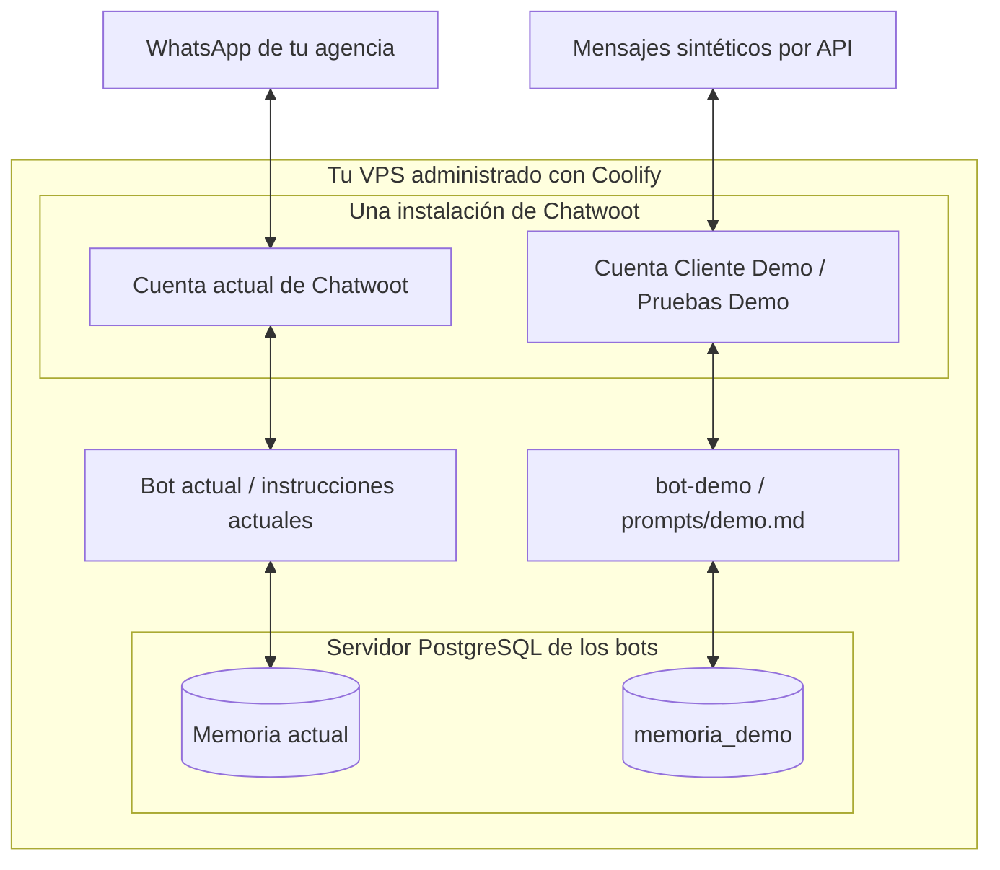

# Piloto Cliente Demo

Objetivo: operar una segunda marca dentro del VPS existente, con cuenta,
credencial, instrucciones y memoria propias. No conecta números ni envía WhatsApp.



Las cuentas de Chatwoot comparten su base con aislamiento lógico. La memoria
de cada bot es otra cosa: este piloto usa una base independiente. Compartir
VPS implica compartir capacidad y posibles caídas del servidor.

## 1. Accesos de preparación

Copiá `.env.admin.example` como `.env.admin.local` si todavía no existe.
Completá el token de una **Platform App** de Chatwoot y un token de la API de
Coolify. No son las credenciales del bot ni las de Meta. El token de perfil de
Chatwoot no reemplaza al de Platform App, aunque tu usuario sea SuperAdmin.

Estos archivos están ignorados por Git y excluidos del contexto Docker:

- `.env.admin.local`: administración; nunca se carga en un bot.
- `.env.demo.local`: configuración privada del nuevo bot.

No pegues secretos en capturas, commits ni mensajes. Revocá los accesos de
preparación cuando ya no los necesites.

## 2. Cuenta, usuarios y bandeja de Chatwoot

1. En **Super Admin → Accounts**, buscá `Cliente Demo`. Creala únicamente si
   no existe y anotá el ID real, sin asumir que será 2.
2. Creá un usuario de prueba y otro técnico, distintos del SuperAdmin de la
   agencia. Asignalos únicamente a Cliente Demo. El usuario de prueba será
   agente; el técnico puede administrar esta cuenta para preparar la bandeja.
3. Dentro de Cliente Demo: **Ajustes → Bandejas → Añadir → API**. Nombre:
   `Pruebas Demo`. Asigná ambos usuarios y anotá el ID de bandeja.
4. Copiá la credencial de perfil del usuario técnico a `CHATWOOT_TOKEN` de
   `.env.demo.local`, y completá `CHATWOOT_CUENTA_ID` y `CHATWOOT_BANDEJA_ID`.
5. Entrá con el usuario de prueba. Confirmá que no pueda acceder a la cuenta
   de la agencia, ni cambiando manualmente el ID en la URL.

Usaremos **un webhook de cuenta**, evento `message_created`, para entrar al bot.
El callback del canal API sirve para integrar la salida con una interfaz propia:
en este piloto dejalo vacío. No pongas el bot también ahí, ni lo asignes además
como Agent Bot: mantener un único recorrido evita entregar dos veces el evento.

Fuente: [bandejas API de Chatwoot](https://www.chatwoot.com/hc/user-guide/articles/1677839703-how-to-create-an-api-channel-inbox).

## 3. Memoria y permisos

La preparación realizada en esta sesión creó `memoria_demo` desde `template0`,
con el rol de conexión `bot_demo`. Sus credenciales están en `.env.demo.local`.
No recrees esa base ni sustituyas la contraseña si ya está preparada.

- El rol no es superusuario, no crea roles ni bases y tiene un límite de cinco conexiones.
- Solo se le otorgaron CONNECT en memoria_demo y USAGE/CREATE en su esquema
  público, necesarios para que LangGraph prepare sus tablas.
- Se retiraron los permisos de PUBLIC sobre la base y su esquema demo.
- Se comprobó que no tiene SELECT ni INSERT en las tablas de memoria de la agencia.
- El propietario de la base continúa siendo el administrador; bot_demo crea
  y mantiene las tablas del checkpointer dentro de su esquema autorizado.

Esto no revoca permisos PUBLIC de otras bases: hacerlo podría afectar servicios
existentes. Poder establecer una conexión a otra base que permita CONNECT a
PUBLIC no implica poder leer sus conversaciones. Para aislamiento físico o
restricción absoluta de conexiones, hace falta otra instancia o reglas de acceso
del servidor; no se prometen con este piloto.

Verificación real de persistencia, sin llamar a Gemini:

```powershell
& "$env:LOCALAPPDATA/Programs/Python/Python313/python.exe" scripts/probar_memoria_demo.py
```

El script escribe un turno sintético, cierra el proceso, lo recupera en otro y
elimina únicamente esa conversación de prueba. Rechaza cualquier base o usuario
que no se llamen `memoria_demo` y `bot_demo`.

## 4. Despliegue separado en Coolify

Antes de construir, comprobá RAM disponible, disco y uso actual. Si no hay
capacidad para otra aplicación y su construcción, posponé el despliegue; no
reinicies ni reduzcas los recursos de la agencia para hacerle espacio.

1. Publicá esta versión en una rama dedicada al piloto y desactivá el despliegue
   automático para bot-demo. No apuntes el servicio actual a la rama del piloto.
2. Creá una **aplicación nueva**, nombre `bot-demo`, mismo repositorio y rama
   del piloto. Build pack Dockerfile; archivo `/Dockerfile`; puerto 8000.
3. Copiá a las variables de ejecución de esa aplicación los valores de
   `.env.demo.local`. Nunca copies `.env.admin.local` ni el `.env` de la agencia.
4. Confirmá estos valores antes de desplegar:

   | Variable | Valor |
   |---|---|
   | `MODO` | `produccion` |
   | `PROMPT_SISTEMA` | `prompts/demo.md` |
   | `CHATWOOT_CUENTA_ID` | ID real de Cliente Demo |
   | `CHATWOOT_BANDEJA_ID` | ID real de Pruebas Demo, obligatorio en el piloto |
   | `CHATWOOT_TOKEN` | Usuario técnico exclusivo de Cliente Demo |
   | `CHATWOOT_WEBHOOK_TOKEN` | Secreto exclusivo del piloto |
   | `POSTGRES_DSN` | Base memoria_demo, usuario bot_demo |
   | `PROVEEDOR` | `gemini` |
   | `MODELO_GEMINI` | Modelo habilitado, verificado al preparar el piloto |
   | `MAX_TOKENS` | `512` |
   | `RITMO_HUMANO` | `false` |

   La preparación local reutiliza la credencial de Gemini de la agencia para
   esta prueba limitada. No representa una cuota ni facturación independiente.
   No se cambia la credencial del servicio actual.

5. En Hostinger agregá solamente el registro A `bot-demo`, apuntando al mismo
   VPS que `agente`. No modifiques los registros actuales.
6. Dominio de la aplicación: `https://bot-demo.automaticnic.online`.
   Activá el health check HTTP GET `/salud`, puerto 8000.
7. Comprobá que el contenedor pueda alcanzar PostgreSQL. El DSN preparado
   localmente usa la dirección accesible desde tu máquina; si necesitás la
   dirección interna de Coolify, cambiá solo host/puerto conservando base,
   usuario y contraseña demo. No copies la conexión administradora.
8. Desplegá únicamente bot-demo. Verificá `/salud` y el estado de agente-ia.

## 5. Webhook y mensajes de prueba

En **Cliente Demo → Ajustes → Integraciones → Webhooks**, configurá una sola
entrada para `message_created`:

```text
https://bot-demo.automaticnic.online/chatwoot/<CHATWOOT_WEBHOOK_TOKEN del demo>
```

El secreto de esta URL es del bot. No es el token de verificación del canal
WhatsApp de Meta ni la clave API de Chatwoot.

Mediante las APIs de Chatwoot y la credencial técnica demo:

Podés ejecutar la prueba controlada ya incluida:

```powershell
& "$env:LOCALAPPDATA/Programs/Python/Python313/python.exe" scripts/probar_bandeja_demo.py
```

Comprueba que la credencial pertenezca únicamente a Cliente Demo y que la
bandeja sea API. Rechaza la cuenta 1 y usuarios SuperAdmin. Envía una sola
consulta y espera la respuesta sin reintentar el envío. Ejecutalo solo cuando
el bot y el webhook estén configurados. El recorrido que realiza es:

1. Creá un contacto sintético, sin teléfono ni correo, asociado a Pruebas Demo.
2. Creá una conversación con su `source_id`, ID de contacto e ID de bandeja.
3. Enviá un único mensaje con `message_type=incoming` y `private=false`:
   «¿Cómo te llamás y cuánto cuesta la libreta azul?».
4. Confirmá en esa conversación que se presenta como Cliente Demo, aclara que
   es una demostración e informa US$ 5. No debe responder sobre TecnoStore.
5. Como máximo, enviá un segundo mensaje para comprobar el contexto. No
   repitas automáticamente el envío si la confirmación de red falla.

Fuentes: [crear contacto](https://developers.chatwoot.com/api-reference/contacts/create-contact),
[crear conversación](https://developers.chatwoot.com/api-reference/conversations/create-new-conversation),
[crear mensaje](https://developers.chatwoot.com/api-reference/messages/create-new-message).

Esta comprobación final sí consume Gemini. Tener /salud en verde no sustituye
ver la respuesta en Chatwoot. La bandeja API no envía mensajes a WhatsApp.

## 6. Criterios de aceptación y estado

- [x] Filtro de cuenta y bandeja, con rechazo de IDs contradictorios o ausentes.
- [x] Configuración sin bandeja conserva las bandejas de la cuenta existente.
- [x] Pruebas sin proveedor: origen cruzado, duplicados, privados, salientes y humano.
- [x] Prompt demo independiente y catálogo marcado como ficticio.
- [x] Base demo y rol propio creados; persistencia entre procesos verificada.
- [x] Capacidad del VPS revisada: KVM 2, CPU 18 %, memoria 29 %, disco 10/100 GB.
- [x] Rama `piloto-demo` publicada; `agente-ia` sigue apuntando a `main`.
- [x] Aplicación `bot-demo` creada en Coolify, sin desplegar, con health check
      `/salud` y 15 de 18 variables cargadas.
- [x] Cuenta Cliente Demo (ID 2) y usuarios exclusivos creados en Chatwoot.
- [x] Bandeja API Pruebas Demo (ID 2) y webhook único configurados.
- [x] DNS y HTTPS del subdominio verificados.
- [x] Respuesta real de Gemini en la bandeja demo.
- [x] Reinicio de bot-demo con agencia disponible y memoria persistente.
- [ ] Usuario de prueba sin acceso a la cuenta de la agencia.

### Estado al 11 de septiembre de 2026

El piloto está funcionando. Lo que quedó montado:

| Pieza | Valor |
|---|---|
| Cuenta de Chatwoot | `Cliente Demo`, ID **2** |
| Bandeja API | `Pruebas Demo`, ID **2** |
| Usuarios | `tecnico.demo@` (administrador), `prueba.demo@` (agente) |
| Aplicación | `bot-demo`, rama `piloto-demo`, 18 variables |
| Dominio | `https://bot-demo.automaticnic.online`, certificado válido |
| Memoria | `memoria_demo`, usuario `bot_demo` |

Comprobado en vivo, no solo con pruebas automáticas:

- El bot responde como Cliente Demo, aclara que es demostración e informa
  US$ 5. No menciona TecnoStore.
- Un evento de la cuenta 1 enviado al webhook del demo se descarta
  (`{"estado":"ignorado"}`), igual que uno de la cuenta 2 con otra bandeja.
  El descarte ocurre antes de llamar a Gemini: un evento cruzado no gasta.
- Tras reiniciar el contenedor, el bot recordó la consulta anterior. La
  memoria sobrevive al reinicio.
- `agente-ia` respondió `200` durante todo el despliegue y el reinicio.

**El DSN cargado en Coolify no es el de `.env.demo.local`.** El archivo usa
`host=2.25.112.244`, que sirve desde tu máquina pero no desde adentro de un
contenedor: la conexión a la IP pública del propio servidor no vuelve. En
Coolify quedó con `host=1hrm4idgdx20aqz5grz12fqb`, el nombre interno del
Postgres. Es el mismo error que dejó al bot de la agencia en bucle de
reinicio la primera vez que se desplegó.

**Credenciales generadas.** Las contraseñas y los tokens de los dos usuarios
demo quedaron en `.credenciales-demo.local`, que Git ignora. Pasalas a tu
gestor de contraseñas y borrá el archivo.

**Queda por hacer, cuando ya no haga falta:** borrar el Platform App
`piloto-demo` desde Super Admin. Es la credencial más poderosa de la
instalación —puede crear y borrar cuentas— y el piloto ya no la necesita.

**Pendiente de verificación manual:** entrar con `prueba.demo@` y confirmar
que no puede alcanzar la cuenta 1, ni cambiando el ID en la URL.

Si el piloto falla, desactivá su webhook y detené únicamente bot-demo.
Conservá su base para diagnóstico. No borres ni reinicies recursos de la agencia.
